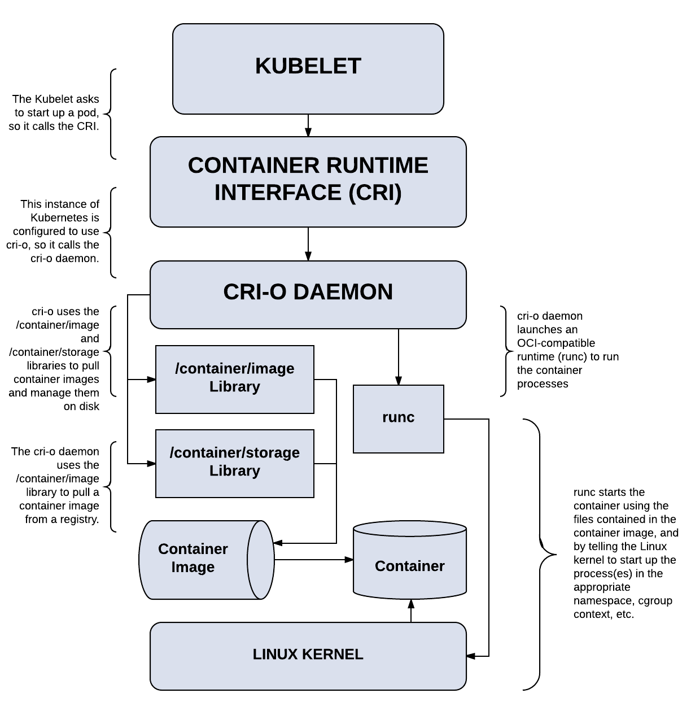

# devops-k8s-shell-scripts
Shell scripts for setup Kubernetes


### Install Kubernetes with CRI-O runtime on CentOS 8 (./crio-centos8)

**Prerequisites:**
* I recommend at least one host with minimum 2 cores, 4 GB RAM, 15 GB HDD  
* Installed CentOS 8 (I recommend "Server" profile)

**Install:**  
Setup version of CRI-O and Kubernetes and run with `sudo` (or from `root`):

    sudo bash -c "export REQUIRED_VERSION=1.18 && ./crio-centos8/k8s-crio-setup.sh"
 
### Add user to Kubernetes cluster and generate KUBECONFIG (./k8s-add-user)

**Using:**  
 
    ./kubeconfig-custom.sh <company-username> <ClusterRole>

URL: https://m.habr.com/ru/company/surfstudio/blog/515040/

---
## CRI-O как замена Docker в качестве исполняемой среды для Kubernetes: настройка на CentOS 8

Привет! Меня зовут Сергей, я DevOps в Surf. DevOps-отдел в Surf ставит своей задачей не только налаживание взаимодействия между специалистами и интеграцию рабочих процессов, но и активные исследования и внедрение актуальных технологий как в собственную инфраструктуру, так и в инфраструктуру заказчика.

Ниже я немного расскажу об изменениях в технологическом стеке для контейнеров, с которыми мы встретились при изучении дистрибутива CentOS 8 и о том, что такое CRI-O и как быстро настроить с его помощью исполняемую среду для Kubernetes.

Почему Docker отсутствует в стандартной поставке CentOS 8

После установки последних крупных релизов RHEL 8 или CentOS 8 нельзя не заметить: в этих дистрибутивах и официальных репозиториях отсутствует приложение Docker, которое идеологически и функционально заменяют собой пакеты Podman, Buildah (присутствуют в дистрибутиве по умолчанию) и CRI-O. Это связано с практической реализацией стандартов, разрабатываемых, в том числе, и компанией Red Hat в рамках проекта Open Container Initiative (OCI).

Цель OCI, являющейся частью The Linux Foundation, — создание открытых индустриальных стандартов для форматов и исполняемой среды контейнеров, которые бы решали сразу несколько задач. Во-первых, не противоречили как философии Linux (например, в той её части, что каждая программа должна выполнять какое-то одно действие, а Docker представляет собой этакий комбайн всё-в-одном). Во-вторых, могли бы устранить все имеющиеся недостатки в программном обеспечении Docker. В-третьих, были бы полностью совместимыми с бизнес-требованиями, выдвигаемыми ведущими коммерческими платформами для развёртывания, управления и обслуживания контейнеризованных приложений (например, Red Hat OpenShift).

Недостатки Docker и достоинства нового ПО уже были довольно подробно описаны в [этой статье](https://habr.com/ru/company/redhatrussia/blog/467105/?_ga=2.112934723.693579566.1604992729-262813773.1586259854), а с подробным описанием как всего предлагаемого в рамках проекта OCI стека ПО и его архитектурными особенностями можно ознакомиться в официальной документации и статьях как от самой Red Hat (неплохая [статья](https://www.redhat.com/en/blog/red-hat-openshift-container-platform-4-now-defaults-cri-o-underlying-container-engine) в Red Hat blog), так и в сторонних [обзорах](https://habr.com/ru/company/flant/blog/340010/?_ga=2.159004413.693579566.1604992729-262813773.1586259854).

Важно отметить, какую функциональность имеют компоненты предлагаемого стека:

`Podman` — непосредственное взаимодействие с контейнерами и хранилищем образов через процесс runC;\
`Buildah` — сборка и загрузка в реестр образов;\
`CRI-O` — исполняемая среда для систем оркестрации контейнеров (например, Kubernetes).

Думаю, что для понимания общей схемы взаимодействия между компонентами стека целесообразно привести здесь схему связей Kubernetes c runC и низкоуровневыми библиотеками с использованием CRI-O:



CRI-O и Kubernetes придерживаются одного и того же цикла выпуска и поддержки (матрица совместимости очень проста: мажорные версии Kubernetes и CRI-O совпадают), а это, с учётом ориентира на полное и всестороннее тестирование работы данного стека разработчиками, даёт нам право ожидать максимально достижимой стабильности в работе при любых сценариях использования (здесь на пользу идет и относительная легковесность CRI-O по сравнению с Docker в силу целенаправленного ограничения функциональности).

При установке Kubernetes «right way» способом (по мнению OCI, конечно) с использованием CRI-O на CentOS 8 мы столкнулись с небольшими затруднениями, которые, однако, успешно преодолели. Буду рад поделиться с вами инструкцией по установке и настройке, которые в совокупности займут от силы 10 минут.

## Как развернуть Kubernetes на CentOS 8 с использованием среды CRI-O

Предварительные условия: наличие как минимум одного хоста (2 cores, 4 GB RAM, накопитель не менее 15 GB) с установленной CentOS 8 (рекомендуется профиль установки «Server»), а также записи для него в локальном DNS (в крайнем случае можно обойтись записью в /etc/hosts). И не забудьте [отключить swap](https://medium.com/tailwinds-navigator/kubernetes-tip-why-disable-swap-on-linux-3505f0250263).

Все операции на хосте производим от имени пользователя `root`, будьте внимательны.

### 1. На первом шаге настроим ОС, установим и настроим предварительные зависимости для CRI-O.

   - Обновим ОС:

```bash
dnf -y update
```
   - Далее требуется настроить файрволл и SELinux. Здесь у нас всё зависит от окружения, в котором будут работать наш хост или хосты. Вы можете либо настроить файрволл по рекомендациям из [документации](https://kubernetes.io/docs/setup/production-environment/tools/kubeadm/install-kubeadm/), либо, если находитесь в доверенной сети или применяете сторонний файрволл, изменить зону по умолчанию на доверенную или выключить файрволл:

```bash
firewall-cmd --set-default-zone trusted

firewall-cmd --reload
```

А ЛУЧШЕ ВСЕГО выключаем фаервол

Чтобы выключить файрволл можно использовать следующую команду:

```bash
systemctl disable --now firewalld
```

`SELinux` требуется **выключить** либо перевести в режим «permissive»:

```bash
setenforce 0

sed -i 's/^SELINUX=enforcing$/SELINUX=permissive/' /etc/selinux/config
```

А ЛУЧШЕ ВСЕГО выключить:


```bash
setenforce 0

sed -i 's/^SELINUX=enforcing$/SELINUX=disabled/' /etc/selinux/config
```

Лучше всего после выключения `selinux` перезапустить сервер/ВМ

   - загрузим необходимые модули ядра и пакеты, настроим автоматическую загрузку модуля «br_netfilter» при старте системы:

```bash
modprobe overlay

modprobe br_netfilter

echo "br_netfilter" >> /etc/modules-load.d/br_netfilter.conf

dnf -y install iproute-tc
```

   - для активации форвардинга пакетов и корректной обработки трафика сделаем соответствующие настройки:

```bash
cat > /etc/sysctl.d/99-kubernetes-cri.conf <<EOF
net.bridge.bridge-nf-call-iptables = 1
net.ipv4.ip_forward = 1
net.bridge.bridge-nf-call-ip6tables = 1
EOF
```

применим сделанные настройки:

```
sysctl --system now
```

   - зададим необходимую версию CRI-O (мажорная версия CRI-O, как уже упоминалось, совпадают с требуемой версией Kubernetes), так как последняя стабильная версия Kubernetes на данный момент 1.19:

```bash
export REQUIRED_VERSION=1.19
```

добавим необходимые репозитории:

```bash
dnf -y install 'dnf-command(copr)'

dnf -y copr enable rhcontainerbot/container-selinux

curl -L -o /etc/yum.repos.d/devel:kubic:libcontainers:stable.repo https://download.opensuse.org/repositories/devel:kubic:libcontainers:stable/CentOS_8/devel:kubic:libcontainers:stable.repo

curl -L -o /etc/yum.repos.d/devel:kubic:libcontainers:stable:cri-o:$REQUIRED_VERSION.repo https://download.opensuse.org/repositories/devel:kubic:libcontainers:stable:cri-o:$REQUIRED_VERSION/CentOS_8/devel:kubic:libcontainers:stable:cri-o:$REQUIRED_VERSION.repo

```

   - теперь мы можем установить CRI-O:

```bash
dnf -y install cri-o
```

Обратите внимание на первый нюанс, который мы встречаем в процессе инсталляции: необходимо отредактировать конфигурацию CRI-O перед запуском сервиса, так как требуемый компонент conmon имеет отличное от указанного место размещения:

> !!! Этого не понял для чего делается пока, но в 1.19 там даже нет такого пути

```bash
sed -i 's/\/usr\/libexec\/crio\/conmon/\/usr\/bin\/conmon/' /etc/crio/crio.conf
```

Теперь можно активировать и запустить демон CRI-O:

```bash
systemctl enable --now crio
```

Можно проверить статус демона:

```bash
systemctl status crio
```


### Установка и активация Kubernetes.

* Добавим требуемый репозиторий:

```
cat <<EOF > /etc/yum.repos.d/kubernetes.repo
[kubernetes]
name=Kubernetes
baseurl=https://packages.cloud.google.com/yum/repos/kubernetes-el7-\$basearch
enabled=1
gpgcheck=1
repo_gpgcheck=1
gpgkey=https://packages.cloud.google.com/yum/doc/yum-key.gpg https://packages.cloud.google.com/yum/doc/rpm-package-key.gpg
exclude=kubelet kubeadm kubectl
EOF
```

Теперь мы можем установить Kubernetes (версии 1.19, как уже указывалось выше):

```
dnf install -y kubelet-1.19* kubeadm-1.19* kubectl-1.19* --disableexcludes=kubernetes
```

* Второй важный нюанс: так как мы не используем демон Docker, а используем демон CRI-O, до запуска и инициализации Kubernetes требуется внести соответствующие настройки в конфигурационный файл `/var/lib/kubelet/config.yaml`, предварительно создав нужный каталог:
```
mkdir /var/lib/kubelet

cat <<EOF > /var/lib/kubelet/config.yaml
apiVersion: kubelet.config.k8s.io/v1beta1
kind: KubeletConfiguration
cgroupDriver: systemd
EOF
```

* Третий важный момент, с которым мы сталкиваемся при установке: несмотря на то, что мы указали используемый драйвер `cgroup`, и его настройка через аргументы передаваемые kubelet устарела (на что прямо указано в документации), нам необходимо добавить в файл аргументы, иначе наш кластер не инициализируется:

```
cat /dev/null > /etc/sysconfig/kubelet

cat <<EOF > /etc/sysconfig/kubelet
KUBELET_EXTRA_ARGS=--container-runtime=remote --cgroup-driver=systemd --container-runtime-endpoint='unix:///var/run/crio/crio.sock'
EOF
```

* Теперь мы можем активировать демон kubelet:

```
systemctl enable --now kubelet
```

Чтобы настроить `control-plane` или `worker` ноды за считанные минуты, вы можете воспользоваться [этим скриптом](crio-centos8/k8s-crio-setup.sh).

### Пора инициализировать наш кластер.

* Для инициализации кластера выполните команду:

```
kubeadm init --pod-network-cidr=10.244.0.0/16
```

Обязательно запишите команду присоединения к кластеру `kubeadm join ...`, которой предлагается воспользоваться в конце вывода, либо, как минимум, указанные токены.

* Установим плагин (CNI) для работы Pod network. Я рекомендую использовать Calico. Возможно, более популярный Flannel имеет проблемы с совместимостью с nftables, да и Calico — единственная реализация CNI, рекомендуемая и полностью протестированная проектом Kubernetes:

Пометка, взята с офф сайта калико
https://docs.projectcalico.org/getting-started/kubernetes/self-managed-onprem/onpremises#install-calico-with-kubernetes-api-datastore-50-nodes-or-less

Имеется возможность установить: 
  - [калико с менее 50 узлами в кластере](https://docs.projectcalico.org/getting-started/kubernetes/self-managed-onprem/onpremises#install-calico-with-kubernetes-api-datastore-50-nodes-or-less)
  - [калико с более 50 узлами в кластере](https://docs.projectcalico.org/getting-started/kubernetes/self-managed-onprem/onpremises#install-calico-with-kubernetes-api-datastore-more-than-50-nodes)
  - [калико с хранилищем данных в etcd](https://docs.projectcalico.org/getting-started/kubernetes/self-managed-onprem/onpremises#install-calico-with-etcd-datastore)

**!!! Не используйте CIDR `192.168.0.0/16` для подов**

* Установка Calico с менее 50 узлами в кластере

```
curl https://docs.projectcalico.org/manifests/calico.yaml -o calico.yaml
kubectl apply -f calico.yaml
```

* Установка Calico с более 50 узлами в кластере
```
curl https://docs.projectcalico.org/manifests/calico-typha.yaml -o calico.yaml
```
 ВАЖНО!!! - Читаем пункт №3 из пункта `Install Calico with Kubernetes API datastore, more than 50 nodes`

* Установка Calico с хранилищем etcd

```
curl https://docs.projectcalico.org/manifests/calico-etcd.yaml -o calico.yaml
```

* Для теста можно взять обычный манифест 3.16

```
kubectl --kubeconfig /etc/kubernetes/admin.conf apply -f https://docs.projectcalico.org/v3.16/manifests/calico.yaml 
```


* Для подключения worker ноды к нашему кластеру её требуется настроить по пунктам инструкции 1 и 2, либо воспользоваться [скриптом](devops-k8s-shell-scripts/crio-centos8/k8s-crio-setup.sh), затем выполнить команду из вывода `kubeadm init ...`, которую мы записали на предыдущем этапе:

```
kubeadm join $CONTROL_PLANE_ADDRESS:6443 --token $TOKEN \
    --discovery-token-ca-cert-hash $TOKEN_HASH
```

* Проверим, что наш кластер инициализирован и начал работу:

```
kubectl --kubeconfig=/etc/kubernetes/admin.conf get pods -A
```

Готово! Вы уже можете размещать на вашем K8s кластере полезную нагрузку.

### Выставляем метки на воркер ноды

--
https://stackoverflow.com/questions/48854905/how-to-add-roles-to-nodes-in-kubernetes

```
# Example
# kubectl label nodes NODE_NAME_NAME node-role.kubernetes.io/node=worker

kubectl label nodes kube-node-1.cluster.local node-role.kubernetes.io/node=worker
```

### Выставляем метки на ингрес ноды и тейнты

* Выставляем метку на ноду которая будет служить Ingress-ом
```
# Example:
# kubectl label nodes INGRESS_NODE_NAME node-role.kubernetes.io/ingress=ingress

kubectl label nodes kube-ingress.cluster.local node-role.kubernetes.io/ingress=ingress
```

*  Выставляем Taint на ноду с ingres-ом
Это нужно для того что бы на данную ноду можно было в будущем задеплоить только ингресс и больше ничего

```
# Example
# kubectl taint nodes INGRESS_NODE_NAME node-role.kubernetes.io/ingress=ingress:NoSchedule

kubectl taint nodes kube-ingress.cluster.local node-role.kubernetes.io/ingress=ingress:NoSchedule
```

## Ввод 2-го и 3-го мастера в кластер

На первом мастере:

```
kubeadm init phase upload-certs --upload-certs
```
и получаем certificate key который истечет через 2 часа и идем на 2-й и 3-й мастер и делаем

```
kubeadm join 172.22.244.222:6443 --token 9vr73a.a8uxyaju799qwdjv --discovery-token-ca-cert-hash sha256:7c2e69131a36ae2a042a339b33381c6d0d43887e2de83720eff5359e26aec866 --control-plane --certificate-key f8902e114ef118304e561c3ecd4d0b543adc226b7a07f675f56564185ffe0c07
```
Где:
  - `172.22.244.222:6443` - IP адрес и порт первого мастера
  - `9vr73a.a8uxyaju799qwdjv` - токен который нам выдал первым мастер при инициализации кластера
  - в параметр `--certificate-key ` указываем certificate key полученные у первого мастера `f8902e114ef118304e561c3ecd4d0b543adc226b7a07f675f56564185ffe0c07`


## Что нас ждёт впереди

Надеюсь, что инструкция выше помогла сэкономить вам немного времени и нервов.
Исход процессов, происходящих в индустрии, зачастую зависит от того, как их принимает основная масса конечных пользователей и разработчиков другого ПО в соответствующей нише. Пока не совсем ясно, к какому итогу через несколько лет приведут инициативы OCI, но мы будем с удовольствием за этим следить. Своим мнением вы можете поделиться прямо сейчас в комментариях.

Stay tuned!

Данная статья появилась благодаря следующим источникам:

Раздел о Container runtimes в документации Kubernetes
Странице проекта CRI-O в сети Internet
Статьям в блогах Red Hat: вот этой, этой и многим другим